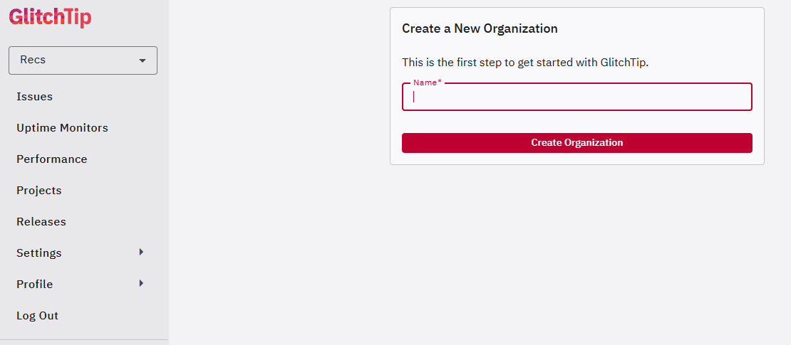
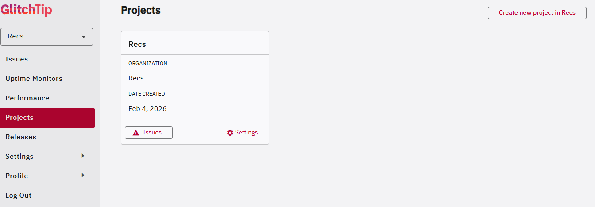
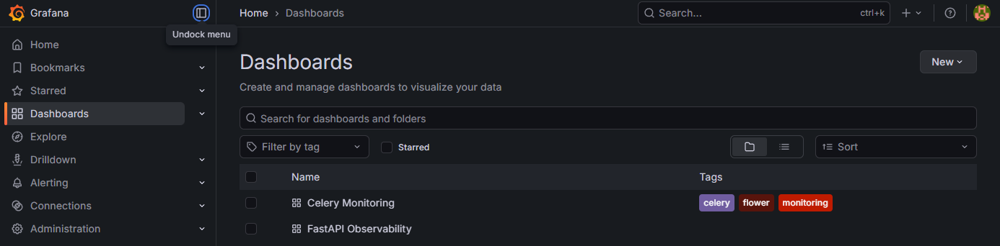
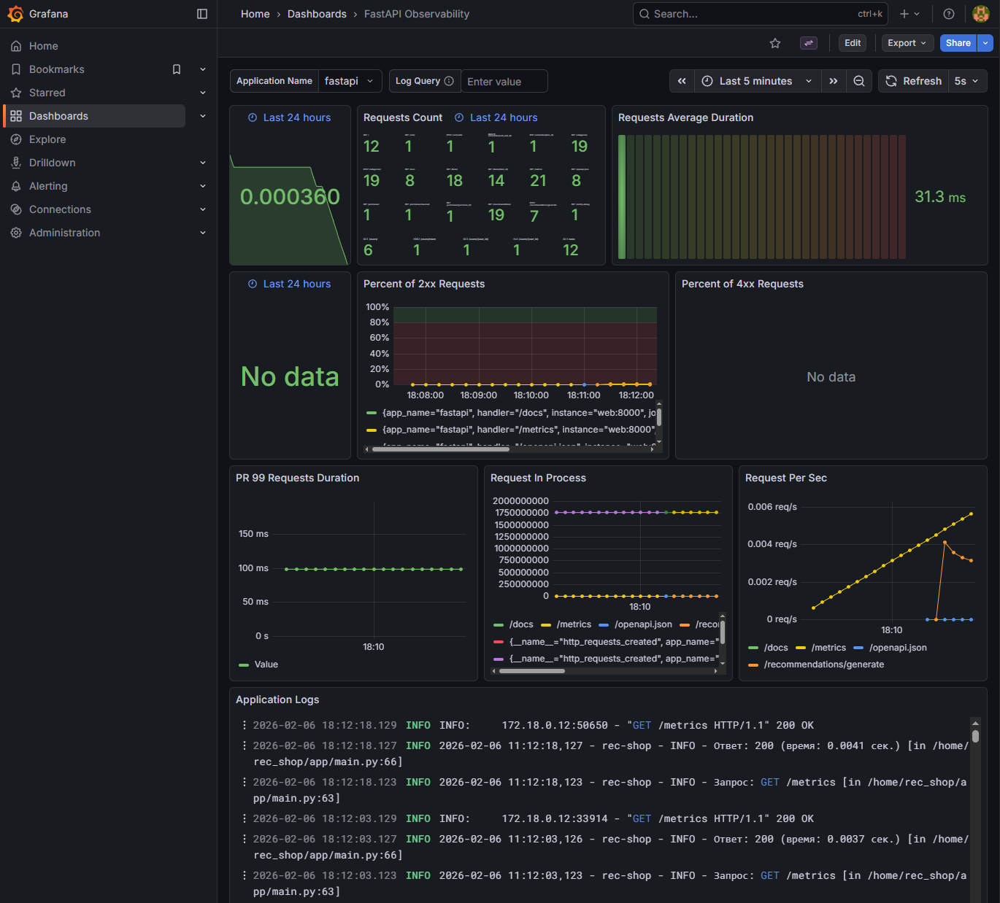
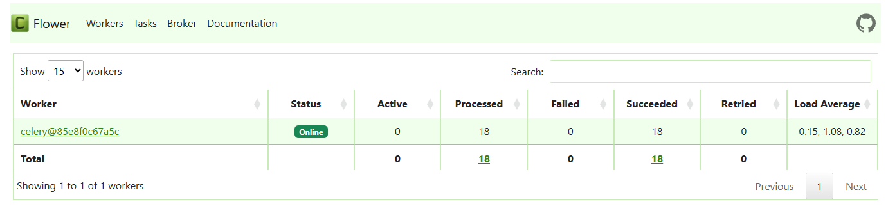
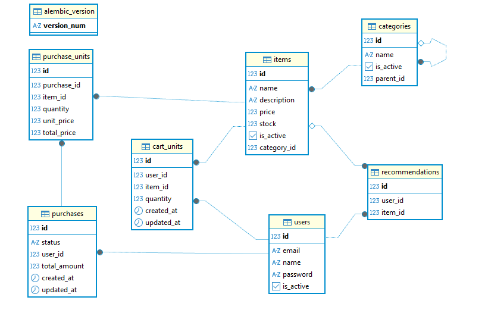

# RecommendationsAPI

[](https://github.com/astral-sh/uv?tab=readme-ov-file)
[](https://www.python.org/)
[](https://fastapi.tiangolo.com)
[](https://www.postgresql.org/)
[](https://www.sqlalchemy.org/)
[](https://redis.io/)
[](https://docs.celeryq.dev/en/stable/)
[](https://https://docker.com/)
[](https://grafana.com/)
[](https://prometheus.io/)
[](https://github.com/aleksandrgurov2605/RecommendationsAPI/actions/workflows/tests.yml)

Магазин с интеллектуальной рекомендательной системой на основе алгоритмов совместных покупок (Matrix Lift).  
Проект включает в себя полный стек мониторинга.

## 🚀 Технологический стек

* **Backend:** [Python 3.14](https://www.python.org/downloads/release/python-3140/), [FastAPI](https://fastapi.tiangolo.com), [SQLAlchemy](https://www.sqlalchemy.org/) (
  Async), [Celery](https://docs.celeryq.dev/en/stable/)
* **Database:** [PostgreSQL 16](https://www.postgresql.org/) (основная), [Redis](https://redis.io/) (брокер задач)
* **Tooling:** [uv](https://github.com/astral-sh/uv?tab=readme-ov-file) (управление
  пакетами), [Alembic](https://alembic.sqlalchemy.org/en/latest/) (миграции)
* **QA:** [Pytest](https://docs.pytest.org/en/stable/) (Async), [Ruff](https://github.com/astral-sh/ruff) (
  линтер), [Mypy](https://mypy-lang.org/) (типизация)
* **Observability:** [Prometheus](https://prometheus.io/) + [Loki](https://grafana.com/docs/loki/latest/) + [Promtail](https://grafana.com/docs/loki/latest/send-data/promtail/) + [Grafana](https://grafana.com/), [Sentry](https://sentry.io/) + [GlitchTip](https://glitchtip.com) (
  ошибки), [Flower](https://flower.readthedocs.io/en/latest/) (мониторинг Celery)
* **DevOps:** [Docker](https://www.docker.com) (
  контейнеризация), [GitHub Actions](https://github.com/features/actions) (CI/CD), [Nginx](https://nginx.org/) (web
  server)

## 🛠 Быстрый старт

### 1. Подготовка окружения

Проект использует современный менеджер пакетов `uv`.

**Установка uv:**

- **macOS/Linux:** `curl -LsSf astral.sh | sh`
- **Windows:** `powershell -c "ir astral.sh | iex"`

**Клонирование и зависимости:**

```bash
git clone https://github.com/aleksandrgurov2605/RecommendationsAPI.git
cd RecommendationsAPI
uv python install 3.14 # Если у вас не установлен python 3.14
uv sync
```

### 2. Конфигурация (.env)

Создайте .env файл на основе образца([.env.example](.env.example)). Важно настроить разные БД для приложения и системы мониторинга ошибок:

```bash
cp .env.example .env 
```

### 3. Запуск в Docker 

```bash
docker compose up -d --build
```

## Мониторинг и управление

После запуска доступны следующие интерфейсы:  
API Docs: http://localhost/docs  — приложение(Swagger UI).  
Grafana: http://localhost/grafana/ — (логин/пароль: admin/admin) — бизнес-метрики и тех. состояние.  
Flower: http://localhost/flower/ — мониторинг Celery задач.  
Prometheus: http://localhost/prometheus/ — cбор метрик.  
GlitchTip  http://gt.localhost/ — трекер ошибок.

### Первичная настройка GlitchTip

```bash
# Создание БД и админа
docker compose exec glitchtip ./manage.py migrate
docker compose exec glitchtip ./manage.py createsuperuser
```

В веб интерфейсе по адресу http://gt.localhost/

1) Создайте организацию (Create New Organization)

<details>
  <summary>📸 Скриншот интерфейса GlitchTip (нажми, чтобы раскрыть)</summary>


</details>

2) Создайте проект(Create new project in OrgName)
<details>
  <summary>📸 Скриншот интерфейса GlitchTip (нажми, чтобы раскрыть)</summary>


</details>

3) Во вкладке Issues скопируйте значения SENTRY_DSN и подставьте в соответствующий параметр(SENTRY_DSN) в файле .env 

4) Перезапустите приложение
```bash
docker compose down
docker compose up -d --build
```

### Для наполнения базы данных фейковыми данными выполните команду

```bash
docker compose exec web /home/rec_shop/seed.sh
```

### Запуск тестов:

```bash
uv run pytest
```

## 📐 Архитектура мониторинга

Проект реализует концепцию Full Stack Observability:  
Logs: Promtail собирает логи контейнеров -> Loki -> Grafana.  
Metrics: Prometheus собирает метрики FastAPI и Flower -> Grafana.  
Errors: Интеграция с GlitchTip для отслеживания исключений в реальном времени.

<details>
  <summary>📸 Скриншоты дашбордов (нажми, чтобы раскрыть)</summary>

### Интерфейс Grafana Dashboards



### Интерфейс Grafana Celery Monitoring


### Интерфейс Grafana FastAPI Observability



### Интерфейс Flower



### Интерфейс Prometheus


</details>

<details>
  <summary>📸 Скриншот ER-диаграммы базы данных (нажми, чтобы раскрыть)</summary>

## Схема базы данных:


</details>

## API Endpoints

<details>
  <summary> Список эндпойнтов (нажми, чтобы раскрыть)</summary>

### 🛒 Товары (Items)

|  Метод   | Эндпоинт           | Описание                              |
|:--------:|:-------------------|:--------------------------------------|
|  `GET`   | `/items/`          | Получить список всех активных товаров |
|  `POST`  | `/items/`          | Создать новый товар                   |
|  `GET`   | `/items/{item_id}` | Получить товар по ID                  |
|  `PUT`   | `/items/{item_id}` | Обновить товар по ID                  |
| `DELETE` | `/items/{item_id}` | Удалить товар по ID                   |

### 📂 Категории (Categories)

|  Метод   | Эндпоинт                    | Описание                       |
|:--------:|:----------------------------|:-------------------------------|
|  `GET`   | `/categories/`              | Получить список всех категорий |
|  `POST`  | `/categories/`              | Создать новую категорию        |
|  `GET`   | `/categories/{category_id}` | Получить категорию по ID       |
|  `PUT`   | `/categories/{category_id}` | Обновить категорию по ID       |
| `DELETE` | `/categories/{category_id}` | Удалить категорию по ID        |

### 🛍️ Корзина (Cart)

|  Метод   | Эндпоинт                     | Описание                               |
|:--------:|:-----------------------------|:---------------------------------------|
|  `GET`   | `/cart/`                     | Получить корзину текущего пользователя |
|  `POST`  | `/cart/units`                | Добавить товар в корзину               |
|  `PUT`   | `/cart/units/{item_id}`      | Обновить количество товара в корзине   |
| `DELETE` | `/cart/units/{cart_unit_id}` | Удалить товар из корзины               |
| `DELETE` | `/cart/`                     | Полностью очистить корзину             |

### 📦 Заказы (Purchases)

| Метод | Эндпоинт                   | Описание                                        |
|:-----:|:---------------------------|:------------------------------------------------|
| `GET` | `/purchases/checkout`      | Оформить заказ на основе корзины                |
| `GET` | `/purchases/`              | Список всех заказов пользователя (с пагинацией) |
| `GET` | `/purchases/{purchase_id}` | Детальная информация о заказе                   |

### 👤 Пользователи и Аутентификация (Users & Auth)

|  Метод   | Эндпоинт               | Описание                                  |
|:--------:|:-----------------------|:------------------------------------------|
|  `POST`  | `/users/token`         | Логин: получение access и refresh токенов |
|  `POST`  | `/users/refresh-token` | Обновить access_token через refresh_token |
|  `GET`   | `/users/`              | Список всех пользователей                 |
|  `POST`  | `/users/`              | Регистрация нового пользователя           |
|  `GET`   | `/users/{user_id}`     | Получить профиль пользователя по ID       |
|  `PUT`   | `/users/{user_id}`     | Обновить данные пользователя              |
| `DELETE` | `/users/{user_id}`     | Удалить пользователя                      |

### 💡 Рекомендации (Recommendations)

| Метод  | Эндпоинт                    | Описание                                    |
|:------:|:----------------------------|:--------------------------------------------|
| `GET`  | `/recommendations/`         | Получить персональные рекомендации          |
| `POST` | `/recommendations/generate` | Запустить фоновую задачу генерации (Celery) |

</details>

# Лицензия
Этот проект распространяется под лицензией MIT. Подробнее в файле [LICENSE](LICENSE).


